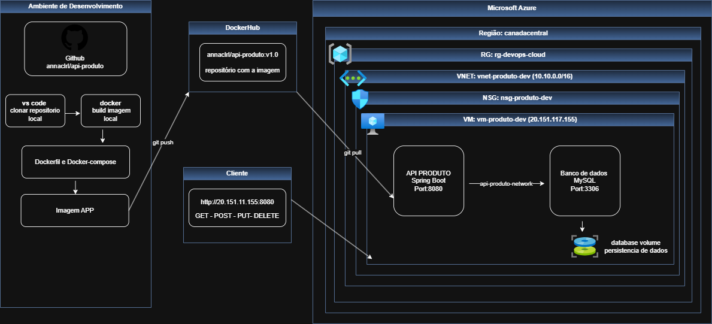
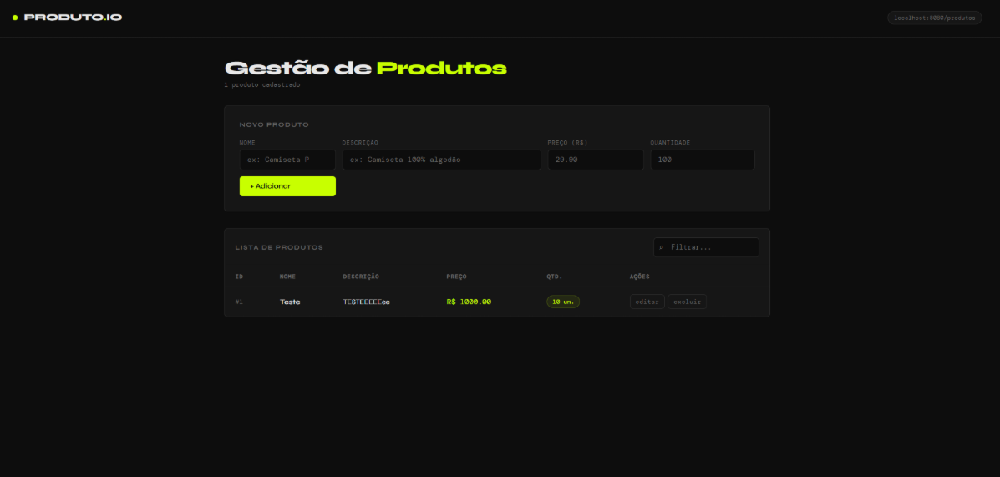

# 🛍️ API Produto 

API REST desenvolvida com Java + Spring Boot para gerenciamento de produtos, utilizando MySQL como banco de dados e Docker para containerização da aplicação.

A aplicação possui:
- CRUD completo de produtos
- Interface visual no navegador
- Persistência de dados com MySQL
- Deploy em máquina virtual Azure utilizando Docker Compose

---

# 🏗️ Arquitetura da Aplicação



---

# ☁️ Infraestrutura Cloud (Azure)

A aplicação está hospedada em uma máquina virtual Ubuntu na Microsoft Azure.

## 📌 Informações da VM

| Configuração | Valor |
|---|---|
| Resource Group | `rg-devops-cloud` |
| Região | `canadacentral` |
| VM | `vm-produto-dev` |
| Sistema Operacional | Ubuntu 22.04 |
| Tamanho | `Standard_B2ats_v2` |
| IP Público | `20.151.117.155` |

---

# 🐳 Containers Docker

A infraestrutura utiliza Docker Compose com dois containers:

| Container | Descrição |
|---|---|
| `api-produto` | Aplicação Spring Boot |
| `mysql` | Banco de dados MySQL 8 |

---

# 🌐 Endpoints da API

| Método | Endpoint | Descrição |
|---|---|---|
| `GET` | `/produtos` | Lista todos os produtos |
| `GET` | `/produtos/{id}` | Busca produto por ID |
| `POST` | `/produtos` | Cria um novo produto |
| `PUT` | `/produtos/{id}` | Atualiza um produto |
| `DELETE` | `/produtos/{id}` | Remove um produto |

---

# 🖥️ Interface Web

A aplicação também possui uma interface visual para gerenciamento dos produtos.



## Funcionalidades

- Cadastro de produtos
- Listagem em tabela
- Busca de produtos
- Edição de registros
- Exclusão de produtos

---

# 🗄️ Banco de Dados

Banco utilizado:

- MySQL 8

## Configurações da aplicação

Arquivo:

```bash
src/main/resources/application.properties
```

---

# 🚀 Executando o Projeto

## Pré-requisitos

- Docker
- Docker Compose

---

## Executar localmente

Na raiz do projeto execute:

```bash
docker compose up --build
```

---

## Acessar aplicação

### Interface Web

```bash
http://20.151.117.155:8080
```

### API REST

```bash
http://20.151.117.155:8080/produtos
```

---

# 🐳 Docker Hub

Imagem publicada no Docker Hub:

```bash
annaclrl/api-produto:v1.0
```

---

# 📦 Estrutura do Projeto

```bash
api-produto/
│
├── src/
├── Dockerfile
├── docker-compose.yml
├── pom.xml
├── README.md
└── assets/
    └── arquitetura.png
```

---

# 🛠️ Tecnologias Utilizadas

- Java 21
- Spring Boot
- Spring Data JPA
- MySQL 8
- Docker
- Docker Compose
- Microsoft Azure
- Maven

---

# 👩‍💻 Desenvolvedora

- Nome: Anna Clara Russo Luca 
- RM: 561928
- Turma: 2TDSPW